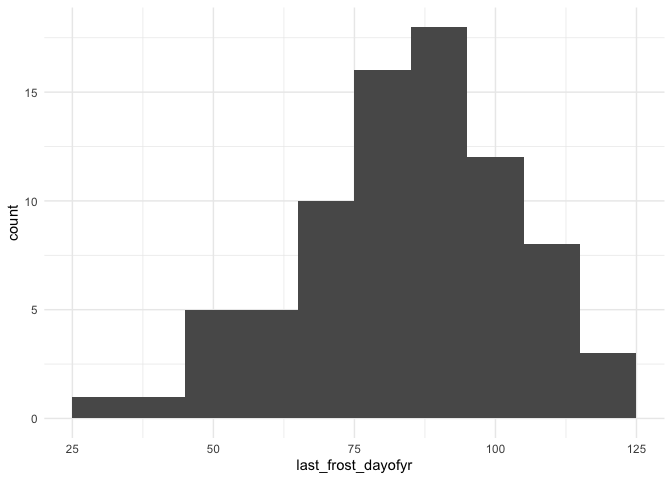
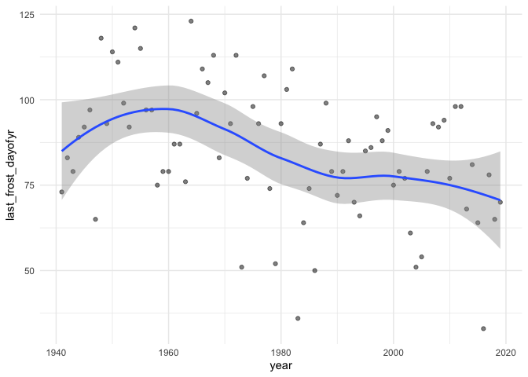
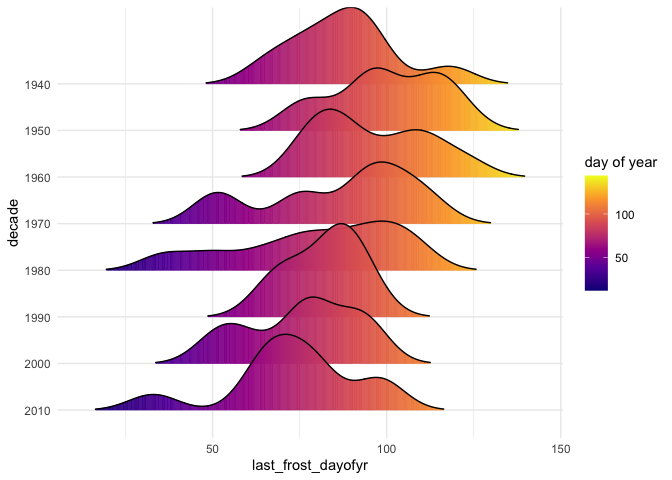

Portland: frost dates
================

# Study frost dates in Portland OR

For garden planning- for lots of vegetables we should wait until after
the last frost of winter to plant.

According to <http://www.multnomahmastergardeners.org/sgp-frostdates>,
for Portland - Airport:

  - Latest Last frost date is April 21
  - Average last frost date is March 28
  - Earliest last frost date is February 29 (Leap day\!?)

## I will take a look at the climate record for Portland airport data.

Data from NOAA: <https://w2.weather.gov/climate/local_data.php?wfo=pqr>
Daily climate record for Portland OR from airport station, 1940-2019

``` r
library(dplyr)
```

    ## 
    ## Attaching package: 'dplyr'

    ## The following objects are masked from 'package:stats':
    ## 
    ##     filter, lag

    ## The following objects are masked from 'package:base':
    ## 
    ##     intersect, setdiff, setequal, union

``` r
library(ggplot2)
library(ggridges)
library(readr)
library(tidyr)
library(tibble)
library(lubridate)
```

    ## 
    ## Attaching package: 'lubridate'

    ## The following objects are masked from 'package:base':
    ## 
    ##     date, intersect, setdiff, union

``` r
library(forcats)

theme_set(theme_minimal())
```

## Read data in

``` r
pdx_climate_raw <- read_csv(
    "Portland_dailyclimatedata.csv", 
    skip = 6)
```

    ## Warning: Missing column names filled in: 'X3' [3]

    ## Parsed with column specification:
    ## cols(
    ##   .default = col_character(),
    ##   YR = col_double(),
    ##   MO = col_double()
    ## )

    ## See spec(...) for full column specifications.

``` r
colnames(pdx_climate_raw) <- c('year','month','obs_type_abbr',
                               paste("day",as.character(seq(1:31)),sep='_'),
                               'avg_or_total')
```

This data is arranged with columns for the day of month and rows for
year, month & observation type:

``` r
head(pdx_climate_raw)
```

    ## # A tibble: 6 x 35
    ##    year month obs_type_abbr day_1 day_2 day_3 day_4 day_5 day_6 day_7 day_8
    ##   <dbl> <dbl> <chr>         <chr> <chr> <chr> <chr> <chr> <chr> <chr> <chr>
    ## 1  1940    10 TX            M     M     M     M     M     M     M     M    
    ## 2  1940    10 TN            M     M     M     M     M     M     M     M    
    ## 3  1940    10 PR            M     M     M     M     M     M     M     M    
    ## 4  1940    10 SN            M     M     M     M     M     M     M     M    
    ## 5  1940    11 TX            52    53    47    55    51    58    56    50   
    ## 6  1940    11 TN            40    38    36    32    42    46    46    42   
    ## # … with 24 more variables: day_9 <chr>, day_10 <chr>, day_11 <chr>,
    ## #   day_12 <chr>, day_13 <chr>, day_14 <chr>, day_15 <chr>, day_16 <chr>,
    ## #   day_17 <chr>, day_18 <chr>, day_19 <chr>, day_20 <chr>, day_21 <chr>,
    ## #   day_22 <chr>, day_23 <chr>, day_24 <chr>, day_25 <chr>, day_26 <chr>,
    ## #   day_27 <chr>, day_28 <chr>, day_29 <chr>, day_30 <chr>, day_31 <chr>,
    ## #   avg_or_total <chr>

So, we need to do some wrangling to make this data easier to analyze

## initial processing and tidying

This data is formatted with a row per year, month observations for Max
Temp, Min Temp, Precipitation, and Snowfall and a column for each day of
the month

Notes before getting into this data: - Plan to pivot this to a longer
format so we have a row per date observation and separate avg/totals -
There are missing values from before the first observations in the
record indicated by “M” - We also have NA values for 2020; we can just
drop these rows - We have values of “T” and “T/A” for precip. and snow,
meaning trace amounts. We will need to do something with those, probably
replace with a value less than the smallest observation above zero,
which seems to be 0.01

#### Drop 2020: all observations are missing

``` r
pdx_climate_wide0 <- filter(pdx_climate_raw,year<2020)
```

## Daily data processing

### Data reshaping

#### Pivot days columns to longer format

``` r
pdx_longer <- pdx_climate_wide0 %>% 
  select(!avg_or_total) %>%
  pivot_longer(
    cols = day_1:day_31,
    names_to = 'day'
  ) %>%
  mutate(
    day = as.numeric(substr(day,5,6))
  )

head(pdx_longer)
```

    ## # A tibble: 6 x 5
    ##    year month obs_type_abbr   day value
    ##   <dbl> <dbl> <chr>         <dbl> <chr>
    ## 1  1940    10 TX                1 M    
    ## 2  1940    10 TX                2 M    
    ## 3  1940    10 TX                3 M    
    ## 4  1940    10 TX                4 M    
    ## 5  1940    10 TX                5 M    
    ## 6  1940    10 TX                6 M

#### drop missing values “M” and “-”

M is at the beginning of the record - is used for days that don’t exist
for that month, like Feb 30

``` r
pdx_longer <- pdx_longer %>% 
  filter(
    !(value %in% c('M','-'))  # Drop missing records
  )
```

#### Use better names for obs\_type

``` r
obs_type_lookup <- tribble(
  ~obs_type_abbr, ~obs_type,
  "TX", "max_temp",
  "TN", "min_temp",
  "PR", "precip",
  "SN", "snow"
)
```

``` r
pdx_longer <- pdx_longer %>%
  inner_join(obs_type_lookup, by='obs_type_abbr')
```

#### pivot obs\_type wider to new fields

``` r
pdx_daily <- pdx_longer %>%
  select(year,month,day,obs_type,value) %>%
  pivot_wider(
    id_cols = c(year,month,day),
    names_from = obs_type,
    values_from = value
  )

head(pdx_daily)
```

    ## # A tibble: 6 x 7
    ##    year month   day max_temp min_temp precip snow 
    ##   <dbl> <dbl> <dbl> <chr>    <chr>    <chr>  <chr>
    ## 1  1940    10    13 75       57       0.01   0    
    ## 2  1940    10    14 70       53       T      0    
    ## 3  1940    10    15 64       52       T      0    
    ## 4  1940    10    16 72       50       0      0    
    ## 5  1940    10    17 72       58       0.13   0    
    ## 6  1940    10    18 78       58       0      0

#### Add date column and day of year

``` r
pdx_daily <- pdx_daily %>%
  mutate(
    date = as.Date(paste(year,month,day,sep='-')),
  ) %>%
  mutate(
    dayofyr = as.integer(
      date - as.Date(paste(year,'01','01',sep='-'))
    ) + 1
  )
```

# Calculate last frost & first frost dates

“Frost” refers to a day with min temp \<= 32 degrees F

Last frost refers to the last frost date from the previous winter, so
calculating it may get a little tricky…

What we could do is make a new column to divide the year in half and get
the max date with temp\<32 in first half of the year for the last frost
and min date with temp\<32 in the second half of the year for the first
frost

## Last frost of year

``` r
last_frost <- pdx_daily %>%
  filter(month <= 6) %>%
  filter(min_temp <= 32) %>%
  group_by(year) %>%
  summarize(
    last_frost_dayofyr = max(dayofyr),
    last_frost_date = max(date)
    ) %>%
  mutate(
    last_frost_md = format(last_frost_date, format="%b-%d")
  )
```

    ## `summarise()` ungrouping output (override with `.groups` argument)

### Plots for last frost day of year

``` r
ggplot(last_frost,aes(last_frost_dayofyr))+geom_histogram(bins=10)
```

<!-- -->

``` r
avg_last_frost_doy <- round(mean(last_frost$last_frost_dayofyr))

pdx_daily %>%
  filter(dayofyr == avg_last_frost_doy) %>%
  group_by(month,day) %>%
  summarize(n=n()) %>%
  arrange(desc(n)) 
```

    ## `summarise()` regrouping output by 'month' (override with `.groups` argument)

    ## # A tibble: 2 x 3
    ## # Groups:   month [1]
    ##   month   day     n
    ##   <dbl> <dbl> <int>
    ## 1     3    26    60
    ## 2     3    25    19

``` r
ggplot(last_frost,aes(year,last_frost_dayofyr))+geom_point(alpha=0.5)+geom_smooth()
```

    ## `geom_smooth()` using method = 'loess' and formula 'y ~ x'

<!-- -->
\#\#\#\# distribution by decade

``` r
last_frost <- last_frost %>% 
  mutate(
    decade = fct_rev(factor(floor(year / 10)*10))
  )
```

``` r
ggplot(last_frost,aes(x=last_frost_dayofyr,y=decade,fill=stat(x)))+
  geom_density_ridges_gradient(scale = 2, rel_min_height = 0.01,bandwidth=7)+
  scale_fill_viridis_c(name="day of year", option = "C")
```

<!-- --> From
these plots we can see the last frost of the year has been occurring
earlier in the year from the 1940s to the 2010s

``` r
last_frost %>% 
  filter(decade == '2010')
```

    ## # A tibble: 10 x 5
    ##     year last_frost_dayofyr last_frost_date last_frost_md decade
    ##    <dbl>              <dbl> <date>          <chr>         <fct> 
    ##  1  2010                 77 2010-03-18      Mar-18        2010  
    ##  2  2011                 98 2011-04-08      Apr-08        2010  
    ##  3  2012                 98 2012-04-07      Apr-07        2010  
    ##  4  2013                 68 2013-03-09      Mar-09        2010  
    ##  5  2014                 81 2014-03-22      Mar-22        2010  
    ##  6  2015                 64 2015-03-05      Mar-05        2010  
    ##  7  2016                 33 2016-02-02      Feb-02        2010  
    ##  8  2017                 78 2017-03-19      Mar-19        2010  
    ##  9  2018                 65 2018-03-06      Mar-06        2010  
    ## 10  2019                 70 2019-03-11      Mar-11        2010

``` r
last_frost %>% 
  filter(decade %in%  c('2000','2010')) %>%
  summarize(
    median_doy = median(last_frost_dayofyr),
    p90_doy = quantile(last_frost_dayofyr,probs=0.9)
  )
```

    ## # A tibble: 1 x 2
    ##   median_doy p90_doy
    ##        <dbl>   <dbl>
    ## 1         77    94.4

``` r
pdx_daily %>%
  filter(dayofyr == 77) %>%
  group_by(month,day) %>%
  summarize(n=n()) %>%
  arrange(desc(n)) 
```

    ## `summarise()` regrouping output by 'month' (override with `.groups` argument)

    ## # A tibble: 2 x 3
    ## # Groups:   month [1]
    ##   month   day     n
    ##   <dbl> <dbl> <int>
    ## 1     3    18    60
    ## 2     3    17    19

``` r
pdx_daily %>%
  filter(dayofyr == 95) %>%
  group_by(month,day) %>%
  summarize(n=n()) %>%
  arrange(desc(n)) 
```

    ## `summarise()` regrouping output by 'month' (override with `.groups` argument)

    ## # A tibble: 2 x 3
    ## # Groups:   month [1]
    ##   month   day     n
    ##   <dbl> <dbl> <int>
    ## 1     4     5    60
    ## 2     4     4    19

It looks unlikely, given the observations in the last two decades, that
the last frost will occur later than April 5th
