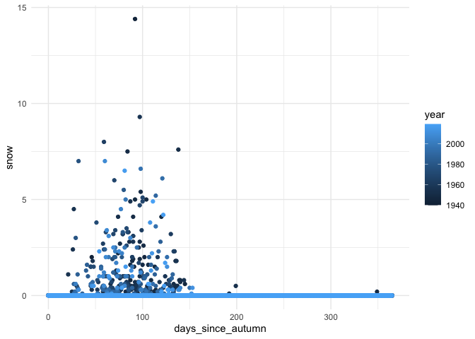
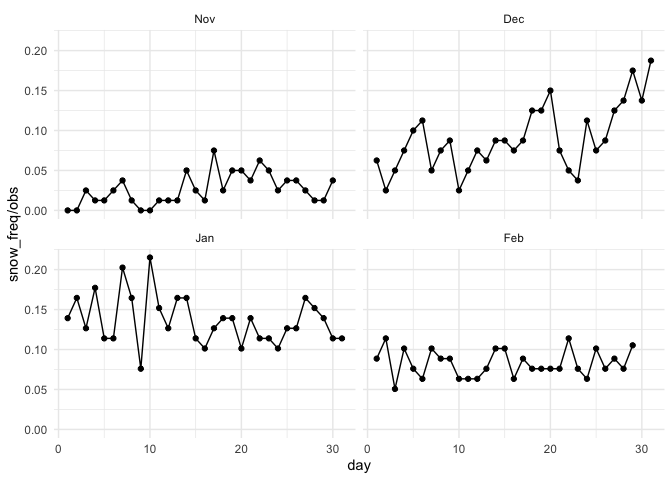
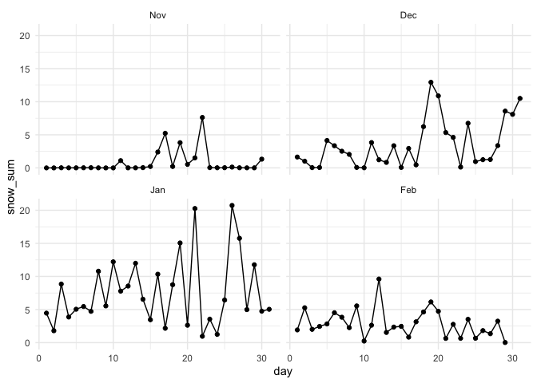
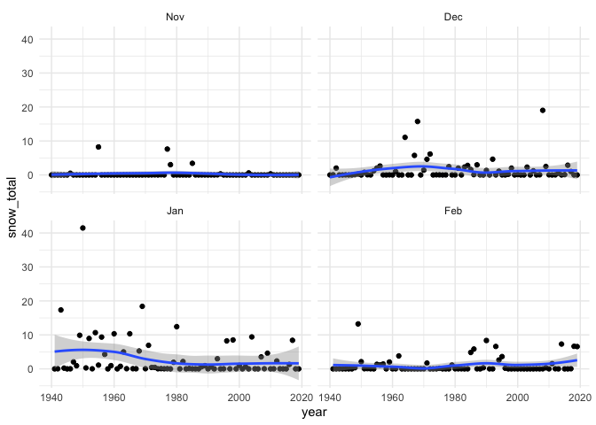
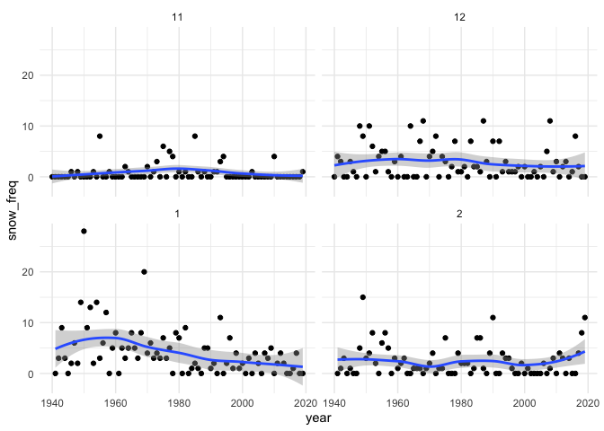

Oregon climate data
================

# Exploring Portland climate data

Data from NOAA: <https://w2.weather.gov/climate/local_data.php?wfo=pqr>

Daily climate record for Portland OR from airport station, 1940-2019

``` r
library(dplyr)
```

    ## 
    ## Attaching package: 'dplyr'

    ## The following objects are masked from 'package:stats':
    ## 
    ##     filter, lag

    ## The following objects are masked from 'package:base':
    ## 
    ##     intersect, setdiff, setequal, union

``` r
library(ggplot2)
library(readr)
library(tidyr)
library(tibble)
library(lubridate)
```

    ## 
    ## Attaching package: 'lubridate'

    ## The following objects are masked from 'package:base':
    ## 
    ##     date, intersect, setdiff, union

``` r
theme_set(theme_minimal())
```

## Read data in

``` r
pdx_climate_raw <- read_csv(
    "Portland_dailyclimatedata.csv", 
    skip = 6)
```

    ## Warning: Missing column names filled in: 'X3' [3]

    ## Parsed with column specification:
    ## cols(
    ##   .default = col_character(),
    ##   YR = col_double(),
    ##   MO = col_double()
    ## )

    ## See spec(...) for full column specifications.

``` r
colnames(pdx_climate_raw)
```

    ##  [1] "YR"           "MO"           "X3"           "1"            "2"           
    ##  [6] "3"            "4"            "5"            "6"            "7"           
    ## [11] "8"            "9"            "10"           "11"           "12"          
    ## [16] "13"           "14"           "15"           "16"           "17"          
    ## [21] "18"           "19"           "20"           "21"           "22"          
    ## [26] "23"           "24"           "25"           "26"           "27"          
    ## [31] "28"           "29"           "30"           "31"           "AVG or Total"

``` r
colnames(pdx_climate_raw) <- c('year','month','obs_type_abbr',
                               paste("day",as.character(seq(1:31)),sep='_'),
                               'avg_or_total')

colnames(pdx_climate_raw)
```

    ##  [1] "year"          "month"         "obs_type_abbr" "day_1"        
    ##  [5] "day_2"         "day_3"         "day_4"         "day_5"        
    ##  [9] "day_6"         "day_7"         "day_8"         "day_9"        
    ## [13] "day_10"        "day_11"        "day_12"        "day_13"       
    ## [17] "day_14"        "day_15"        "day_16"        "day_17"       
    ## [21] "day_18"        "day_19"        "day_20"        "day_21"       
    ## [25] "day_22"        "day_23"        "day_24"        "day_25"       
    ## [29] "day_26"        "day_27"        "day_28"        "day_29"       
    ## [33] "day_30"        "day_31"        "avg_or_total"

``` r
str(pdx_climate_raw)
```

    ## tibble [3,808 × 35] (S3: spec_tbl_df/tbl_df/tbl/data.frame)
    ##  $ year         : num [1:3808] 1940 1940 1940 1940 1940 1940 1940 1940 1940 1940 ...
    ##  $ month        : num [1:3808] 10 10 10 10 11 11 11 11 12 12 ...
    ##  $ obs_type_abbr: chr [1:3808] "TX" "TN" "PR" "SN" ...
    ##  $ day_1        : chr [1:3808] "M" "M" "M" "M" ...
    ##  $ day_2        : chr [1:3808] "M" "M" "M" "M" ...
    ##  $ day_3        : chr [1:3808] "M" "M" "M" "M" ...
    ##  $ day_4        : chr [1:3808] "M" "M" "M" "M" ...
    ##  $ day_5        : chr [1:3808] "M" "M" "M" "M" ...
    ##  $ day_6        : chr [1:3808] "M" "M" "M" "M" ...
    ##  $ day_7        : chr [1:3808] "M" "M" "M" "M" ...
    ##  $ day_8        : chr [1:3808] "M" "M" "M" "M" ...
    ##  $ day_9        : chr [1:3808] "M" "M" "M" "M" ...
    ##  $ day_10       : chr [1:3808] "M" "M" "M" "M" ...
    ##  $ day_11       : chr [1:3808] "M" "M" "M" "M" ...
    ##  $ day_12       : chr [1:3808] "M" "M" "M" "M" ...
    ##  $ day_13       : chr [1:3808] "75" "57" "0.01" "0" ...
    ##  $ day_14       : chr [1:3808] "70" "53" "T" "0" ...
    ##  $ day_15       : chr [1:3808] "64" "52" "T" "0" ...
    ##  $ day_16       : chr [1:3808] "72" "50" "0" "0" ...
    ##  $ day_17       : chr [1:3808] "72" "58" "0.13" "0" ...
    ##  $ day_18       : chr [1:3808] "78" "58" "0" "0" ...
    ##  $ day_19       : chr [1:3808] "78" "59" "T" "0" ...
    ##  $ day_20       : chr [1:3808] "64" "54" "0.14" "0" ...
    ##  $ day_21       : chr [1:3808] "63" "48" "0.05" "0" ...
    ##  $ day_22       : chr [1:3808] "61" "41" "0" "0" ...
    ##  $ day_23       : chr [1:3808] "58" "53" "0.63" "0" ...
    ##  $ day_24       : chr [1:3808] "57" "48" "1.03" "0" ...
    ##  $ day_25       : chr [1:3808] "57" "41" "0" "0" ...
    ##  $ day_26       : chr [1:3808] "57" "38" "0" "0" ...
    ##  $ day_27       : chr [1:3808] "56" "37" "T" "0" ...
    ##  $ day_28       : chr [1:3808] "53" "45" "0.18" "0" ...
    ##  $ day_29       : chr [1:3808] "59" "48" "0.58" "0" ...
    ##  $ day_30       : chr [1:3808] "59" "50" "0.5" "0" ...
    ##  $ day_31       : chr [1:3808] "52" "46" "0.25" "0" ...
    ##  $ avg_or_total : chr [1:3808] "M" "M" "M" "0" ...
    ##  - attr(*, "spec")=
    ##   .. cols(
    ##   ..   YR = col_double(),
    ##   ..   MO = col_double(),
    ##   ..   X3 = col_character(),
    ##   ..   `1` = col_character(),
    ##   ..   `2` = col_character(),
    ##   ..   `3` = col_character(),
    ##   ..   `4` = col_character(),
    ##   ..   `5` = col_character(),
    ##   ..   `6` = col_character(),
    ##   ..   `7` = col_character(),
    ##   ..   `8` = col_character(),
    ##   ..   `9` = col_character(),
    ##   ..   `10` = col_character(),
    ##   ..   `11` = col_character(),
    ##   ..   `12` = col_character(),
    ##   ..   `13` = col_character(),
    ##   ..   `14` = col_character(),
    ##   ..   `15` = col_character(),
    ##   ..   `16` = col_character(),
    ##   ..   `17` = col_character(),
    ##   ..   `18` = col_character(),
    ##   ..   `19` = col_character(),
    ##   ..   `20` = col_character(),
    ##   ..   `21` = col_character(),
    ##   ..   `22` = col_character(),
    ##   ..   `23` = col_character(),
    ##   ..   `24` = col_character(),
    ##   ..   `25` = col_character(),
    ##   ..   `26` = col_character(),
    ##   ..   `27` = col_character(),
    ##   ..   `28` = col_character(),
    ##   ..   `29` = col_character(),
    ##   ..   `30` = col_character(),
    ##   ..   `31` = col_character(),
    ##   ..   `AVG or Total` = col_character()
    ##   .. )

## initial processing and tidying

This data is formatted with a row per year, month observations for Max
Temp, Min Temp, Precipitation, and Snowfall and a column for each day of
the month

``` r
head(pdx_climate_raw)
```

    ## # A tibble: 6 x 35
    ##    year month obs_type_abbr day_1 day_2 day_3 day_4 day_5 day_6 day_7 day_8
    ##   <dbl> <dbl> <chr>         <chr> <chr> <chr> <chr> <chr> <chr> <chr> <chr>
    ## 1  1940    10 TX            M     M     M     M     M     M     M     M    
    ## 2  1940    10 TN            M     M     M     M     M     M     M     M    
    ## 3  1940    10 PR            M     M     M     M     M     M     M     M    
    ## 4  1940    10 SN            M     M     M     M     M     M     M     M    
    ## 5  1940    11 TX            52    53    47    55    51    58    56    50   
    ## 6  1940    11 TN            40    38    36    32    42    46    46    42   
    ## # … with 24 more variables: day_9 <chr>, day_10 <chr>, day_11 <chr>,
    ## #   day_12 <chr>, day_13 <chr>, day_14 <chr>, day_15 <chr>, day_16 <chr>,
    ## #   day_17 <chr>, day_18 <chr>, day_19 <chr>, day_20 <chr>, day_21 <chr>,
    ## #   day_22 <chr>, day_23 <chr>, day_24 <chr>, day_25 <chr>, day_26 <chr>,
    ## #   day_27 <chr>, day_28 <chr>, day_29 <chr>, day_30 <chr>, day_31 <chr>,
    ## #   avg_or_total <chr>

``` r
tail(pdx_climate_raw)
```

    ## # A tibble: 6 x 35
    ##    year month obs_type_abbr day_1 day_2 day_3 day_4 day_5 day_6 day_7 day_8
    ##   <dbl> <dbl> <chr>         <chr> <chr> <chr> <chr> <chr> <chr> <chr> <chr>
    ## 1  2019    12 PR            0.12  0     0     T     0     0.25  0.46  T    
    ## 2  2019    12 SN            0     0     0     0     0     0     0     0    
    ## 3  2020     1 TX            <NA>  <NA>  <NA>  <NA>  <NA>  <NA>  <NA>  <NA> 
    ## 4  2020     1 TN            <NA>  <NA>  <NA>  <NA>  <NA>  <NA>  <NA>  <NA> 
    ## 5  2020     1 PR            <NA>  <NA>  <NA>  <NA>  <NA>  <NA>  <NA>  <NA> 
    ## 6  2020     1 SN            <NA>  <NA>  <NA>  <NA>  <NA>  <NA>  <NA>  <NA> 
    ## # … with 24 more variables: day_9 <chr>, day_10 <chr>, day_11 <chr>,
    ## #   day_12 <chr>, day_13 <chr>, day_14 <chr>, day_15 <chr>, day_16 <chr>,
    ## #   day_17 <chr>, day_18 <chr>, day_19 <chr>, day_20 <chr>, day_21 <chr>,
    ## #   day_22 <chr>, day_23 <chr>, day_24 <chr>, day_25 <chr>, day_26 <chr>,
    ## #   day_27 <chr>, day_28 <chr>, day_29 <chr>, day_30 <chr>, day_31 <chr>,
    ## #   avg_or_total <chr>

Notes before getting into this data: - Plan to pivot this to a longer
format so we have a row per date observation and separate avg/totals -
There are missing values from before the first observations in the
record indicated by “M” - We also have NA values for 2020; we can just
drop these rows - We have values of “T” and “T/A” for precip. and snow,
meaning trace amounts. We will need to do something with those, probably
replace with a value less than the smallest observation above zero,
which seems to be 0.01

#### Drop 2020: all observations are missing

``` r
pdx_climate_wide0 <- filter(pdx_climate_raw,year<2020)
```

## Daily data processing

### Data reshaping

#### Pivot days columns to longer format

``` r
pdx_longer <- pdx_climate_wide0 %>% 
  select(!avg_or_total) %>%
  pivot_longer(
    cols = day_1:day_31,
    names_to = 'day'
  ) %>%
  mutate(
    day = as.numeric(substr(day,5,6))
  )

head(pdx_longer)
```

    ## # A tibble: 6 x 5
    ##    year month obs_type_abbr   day value
    ##   <dbl> <dbl> <chr>         <dbl> <chr>
    ## 1  1940    10 TX                1 M    
    ## 2  1940    10 TX                2 M    
    ## 3  1940    10 TX                3 M    
    ## 4  1940    10 TX                4 M    
    ## 5  1940    10 TX                5 M    
    ## 6  1940    10 TX                6 M

#### drop missing values “M” and “-”

M is at the beginning of the record - is used for days that don’t exist
for that month, like Feb 30

``` r
pdx_longer <- pdx_longer %>% 
  filter(
    !(value %in% c('M','-'))  # Drop missing records
  )
```

#### Use better names for obs\_type

``` r
obs_type_lookup <- tribble(
  ~obs_type_abbr, ~obs_type,
  "TX", "max_temp",
  "TN", "min_temp",
  "PR", "precip",
  "SN", "snow"
)
```

``` r
pdx_longer <- pdx_longer %>%
  inner_join(obs_type_lookup, by='obs_type_abbr')
```

#### pivot obs\_type wider to new fields

``` r
pdx_daily <- pdx_longer %>%
  select(year,month,day,obs_type,value) %>%
  pivot_wider(
    id_cols = c(year,month,day),
    names_from = obs_type,
    values_from = value
  )

head(pdx_daily)
```

    ## # A tibble: 6 x 7
    ##    year month   day max_temp min_temp precip snow 
    ##   <dbl> <dbl> <dbl> <chr>    <chr>    <chr>  <chr>
    ## 1  1940    10    13 75       57       0.01   0    
    ## 2  1940    10    14 70       53       T      0    
    ## 3  1940    10    15 64       52       T      0    
    ## 4  1940    10    16 72       50       0      0    
    ## 5  1940    10    17 72       58       0.13   0    
    ## 6  1940    10    18 78       58       0      0

## Replace “trace amount” with a small value

Take a look at values that are not 0 or Trace amount

``` r
pdx_daily %>% 
  select(precip,snow) %>%
  filter(!(precip %in% c('T','T/A','0')) & !(snow %in% c('T','T/A','0'))) %>%
  mutate(
    precip = as.numeric(precip),
    snow = as.numeric(snow)
  ) %>%
  summary
```

    ## Warning in mask$eval_all_mutate(dots[[i]]): NAs introduced by coercion

    ##      precip            snow       
    ##  Min.   :0.0100   Min.   : 0.100  
    ##  1st Qu.:0.0700   1st Qu.: 0.300  
    ##  Median :0.1600   Median : 0.800  
    ##  Mean   :0.2597   Mean   : 1.482  
    ##  3rd Qu.:0.3250   3rd Qu.: 2.000  
    ##  Max.   :1.9800   Max.   :14.400  
    ##                   NA's   :6

Looks like 0.01 is smallest measured value for precipitation, 0.1 for
snow

Also- there are a few values in snow with “/A” after a valid number, ex:

``` r
pdx_daily %>% filter(year == 1953 & month == 5 & day %in% c(1,8))
```

    ## # A tibble: 2 x 7
    ##    year month   day max_temp min_temp precip snow 
    ##   <dbl> <dbl> <dbl> <chr>    <chr>    <chr>  <chr>
    ## 1  1953     5     1 57       42       0.3    0.1/A
    ## 2  1953     5     8 58       45       0.26   0.5/A

I can’t seem to find what that means in the NOAA documentation. We will
just remove the “/A” value in snow

``` r
pdx_daily <- pdx_daily %>%
  mutate(
    snow = sub("/A","",snow)
  )
```

``` r
pdx_daily %>% filter(year == 1953 & month == 5 & day %in% c(1,8))
```

    ## # A tibble: 2 x 7
    ##    year month   day max_temp min_temp precip snow 
    ##   <dbl> <dbl> <dbl> <chr>    <chr>    <chr>  <chr>
    ## 1  1953     5     1 57       42       0.3    0.1  
    ## 2  1953     5     8 58       45       0.26   0.5

Now to replace Trace amounts

``` r
pdx_daily <- pdx_daily %>%
  mutate(
    obs_date = make_date(year,month,day),
    max_temp = as.numeric(max_temp),
    min_temp = as.numeric(min_temp),
    precip = as.numeric(ifelse(precip == "T",0.001,precip)),
    snow = as.numeric(ifelse(snow == "T",0.01,snow))
  ) %>% 
  mutate(
    snow = ifelse(is.na(snow),0,snow),
    dayofyear = as.integer(obs_date - make_date(year,1,1)) + 1,
    days_since_autumn = ifelse(month < 10 | (month == 10 & day < 21),
                               obs_date - make_date(year-1,10,21),
                               obs_date - make_date(year,10,21))
  )
  

head(pdx_daily)
```

    ## # A tibble: 6 x 10
    ##    year month   day max_temp min_temp precip  snow obs_date   dayofyear
    ##   <dbl> <dbl> <dbl>    <dbl>    <dbl>  <dbl> <dbl> <date>         <dbl>
    ## 1  1940    10    13       75       57  0.01      0 1940-10-13       287
    ## 2  1940    10    14       70       53  0.001     0 1940-10-14       288
    ## 3  1940    10    15       64       52  0.001     0 1940-10-15       289
    ## 4  1940    10    16       72       50  0         0 1940-10-16       290
    ## 5  1940    10    17       72       58  0.13      0 1940-10-17       291
    ## 6  1940    10    18       78       58  0         0 1940-10-18       292
    ## # … with 1 more variable: days_since_autumn <dbl>

# Data visualization

## When does it snow in Portland?

``` r
ggplot(pdx_daily,aes(days_since_autumn,snow,color=year))+geom_point()
```

<!-- -->

``` r
# snow summary by month, day
snow_day_summary <- pdx_daily %>%
  
  filter(month %in% c(11,12,1,2)) %>%
  group_by(month,day) %>%
  summarise(
    obs = n(),
    snow_record = max(snow),
    snow_sum = sum(snow),
    snow_freq = sum(I(snow>0))
  )
```

    ## `summarise()` regrouping output by 'month' (override with `.groups` argument)

``` r
head(snow_day_summary)
```

    ## # A tibble: 6 x 6
    ## # Groups:   month [1]
    ##   month   day   obs snow_record snow_sum snow_freq
    ##   <dbl> <dbl> <int>       <dbl>    <dbl>     <int>
    ## 1     1     1    79         1.7     4.46        11
    ## 2     1     2    79         1       1.8         13
    ## 3     1     3    79         4.1     8.85        10
    ## 4     1     4    79         2.3     3.87        14
    ## 5     1     5    79         2.7     5.05         9
    ## 6     1     6    79         4.5     5.46         9

``` r
ggplot(snow_day_summary,aes(day,snow_freq/obs))+geom_point()+geom_line()+facet_wrap(~factor(month,labels = c("Nov","Dec","Jan","Feb"),levels=c(11,12,1,2)))
```

<!-- -->

``` r
ggplot(snow_day_summary,aes(day,snow_sum))+geom_point()+geom_line()+facet_wrap(~factor(month,labels = c("Nov","Dec","Jan","Feb"),levels=c(11,12,1,2)))
```

<!-- -->

``` r
# monthly snow totals trend over time
pdx_daily %>%
  filter(month %in% c(11,12,1,2)) %>%
  group_by(year,month) %>%
  summarize(snow_total = sum(snow)) %>%
  ggplot(aes(year,snow_total)) + geom_point() + geom_smooth() +facet_wrap(~factor(month,labels = c("Nov","Dec","Jan","Feb"),levels=c(11,12,1,2)))
```

    ## `summarise()` regrouping output by 'year' (override with `.groups` argument)

    ## `geom_smooth()` using method = 'loess' and formula 'y ~ x'

<!-- -->

``` r
# monthly snow freq trend over time
pdx_daily %>%
  filter(month %in% c(11,12,1,2)) %>%
  group_by(year,month) %>%
  summarize(snow_freq = sum(I(snow>0))) %>%
  ggplot(aes(year,snow_freq)) + geom_point() + geom_smooth() +facet_wrap(~factor(month,levels=c(10,11,12,1,2,3)))
```

    ## `summarise()` regrouping output by 'year' (override with `.groups` argument)

    ## `geom_smooth()` using method = 'loess' and formula 'y ~ x'

<!-- -->
