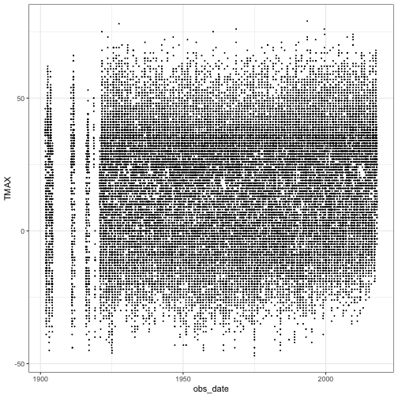
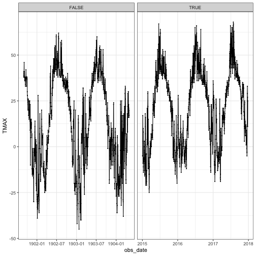
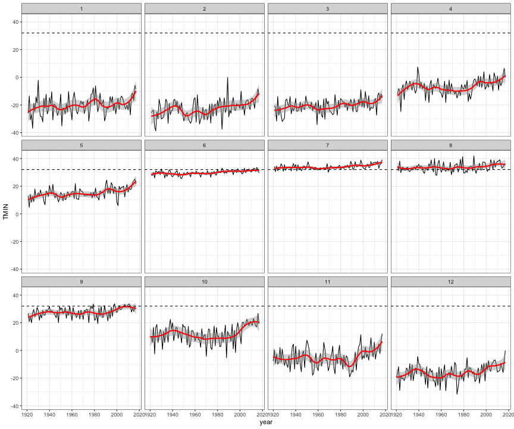
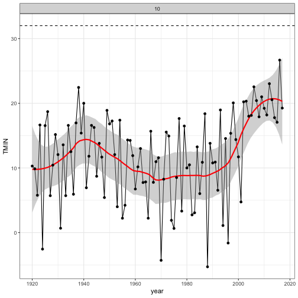

This is a small analysis of Barrow daily weather summaries sourced from NOAA (https://www.ncdc.noaa.gov/cdo-web/datasets). 

I was inspired to look at Barrow weather data by reading in the Washington Post about how the data there was setting off outlier detection climate models (https://www.washingtonpost.com/news/capital-weather-gang/wp/2017/12/12/barrow-is-warming-so-fast-algorithms-removed-the-data-because-it-seemed-unreal/?utm_term=.7a5b322526b4) 
and reading this climate.gov article about rising average temperatures for October (https://www.climate.gov/news-features/understanding-climate/barrow-alaska-climate-change-action)


```r
library(ggplot2)
library(plyr)
library(forecast)
library(ggmap)
```

```
## Error in library(ggmap): there is no package called 'ggmap'
```

```r
# read NOAA daily summary data for Barrow
barrow <- read.csv("~/Documents/Climate-Weather/barrowAK_daily.csv", stringsAsFactors=FALSE)
barrow = barrow[,c('STATION','NAME','LATITUDE','LONGITUDE','ELEVATION','DATE'
                   ,'AWND','PGTM','PRCP','SNOW','TMIN','TAVG','TMAX')]
str(barrow)
```

```
## 'data.frame':	37496 obs. of  13 variables:
##  $ STATION  : chr  "USW00027502" "USW00027502" "USW00027502" "USW00027502" ...
##  $ NAME     : chr  "BARROW W POST W ROGERS AIRPORT, AK US" "BARROW W POST W ROGERS AIRPORT, AK US" "BARROW W POST W ROGERS AIRPORT, AK US" "BARROW W POST W ROGERS AIRPORT, AK US" ...
##  $ LATITUDE : num  71.3 71.3 71.3 71.3 71.3 ...
##  $ LONGITUDE: num  -157 -157 -157 -157 -157 ...
##  $ ELEVATION: num  9.4 9.4 9.4 9.4 9.4 9.4 9.4 9.4 9.4 9.4 ...
##  $ DATE     : chr  "1901-09-01" "1901-09-02" "1901-09-03" "1901-09-04" ...
##  $ AWND     : num  NA NA NA NA NA NA NA NA NA NA ...
##  $ PGTM     : int  NA NA NA NA NA NA NA NA NA NA ...
##  $ PRCP     : num  0 0 0 0 0.03 0.02 0.03 0.03 0.06 0 ...
##  $ SNOW     : num  0 0 NA NA NA NA NA NA NA NA ...
##  $ TMIN     : int  30 29 29 32 32 30 30 29 24 23 ...
##  $ TAVG     : int  NA NA NA NA NA NA NA NA NA NA ...
##  $ TMAX     : int  38 41 39 40 46 38 38 41 38 36 ...
```

```r
range(barrow$DATE)
```

```
## [1] "1901-09-01" "2017-12-27"
```

This data is from the Barrow airport weather station and spans from Sept 1901 to Dec 2017. 

Let's look at where Barrow is on map of Alaska with the Arctic Circle (66.33 degrees latitude) shown:


```r
barrow_location = barrow[1,c('LONGITUDE','LATITUDE')]
barrow_map = get_map(location='alaska',zoom=4)
```

```
## Error in get_map(location = "alaska", zoom = 4): could not find function "get_map"
```

```r
ggmap(barrow_map)+geom_point(data=barrow,aes(x=LONGITUDE,y=LATITUDE),shape=1,color='red',size=3)+
  geom_hline(lty=2,aes(yintercept=66.33))
```

```
## Error in ggmap(barrow_map): could not find function "ggmap"
```


There are gaps in the earlier years of the data:


```r
barrow$obs_date = as.Date(barrow$DATE)
barrow$year = as.numeric(unlist(lapply(barrow$DATE,FUN=function(s){strsplit(s,split='-')[[1]][1]})))
barrow$month = as.numeric(unlist(lapply(barrow$DATE,FUN=function(s){strsplit(s,split='-')[[1]][2]})))
barrow$dayofmonth = as.numeric(unlist(lapply(barrow$DATE,FUN=function(s){strsplit(s,split='-')[[1]][3]})))

ggplot(barrow,aes(obs_date,TMAX))+geom_point(size=0.1)+theme_bw()
```

```
## Warning: Removed 196 rows containing missing values (geom_point).
```



From October 1920 on is available without any major gaps in the data.

It may be interesting to compare some of the earliest and latest years in the data


```r
ggplot(subset(barrow,DATE<'1905-01-01'|DATE>'2015-01-01'),aes(obs_date,TMAX))+geom_point(size=0.1)+geom_line()+theme_bw()+facet_grid(~I(DATE>'1915-01-01'),scales='free_x')
```

```
## Warning: Removed 15 rows containing missing values (geom_point).
```

```
## Warning: Removed 2 rows containing missing values (geom_path).
```



Following the climate.gov article, let's look at monthly averages over time starting in Oct 1920:


```r
continuous_obs_start = as.Date('1920-10-01')
barrow_monthlyavgs = ddply(barrow[barrow$obs_date>=continuous_obs_start,],c('year','month'),function(d){
  data.frame(TMIN=mean(d$TMIN,na.rm=TRUE)
             ,TMAX=mean(d$TMAX,na.rm=TRUE)
             ,PRCP=mean(d$PRCP,na.rm=TRUE)
             ,AWND=mean(d$AWND,na.rm=TRUE)
             )
})
ggplot(barrow_monthlyavgs,aes(year,TMIN))+geom_line()+theme_bw()+facet_wrap(~month)+
  geom_smooth(se=TRUE,color='red',span=0.3)+
  geom_hline(lty=2,aes(yintercept=32))
```

```
## `geom_smooth()` using method = 'loess' and formula 'y ~ x'
```



We can see some increase in the monthly average lows for all months, but the Fall and Winter months in particular show a dramatic rise in the last decade. 

October in particular has had no average lows below 15F since 2001, before which average October lows below 15F occurred 72% of the years.


```r
mean(subset(barrow_monthlyavgs,month==10 & year<=2001)$TMIN<15)
```

```
## [1] 0.7195122
```

```r
ggplot(subset(barrow_monthlyavgs,month==10),aes(year,TMIN))+geom_line()+theme_bw()+facet_wrap(~month)+
  geom_smooth(se=TRUE,color='red',span=0.3)+geom_point()+
  geom_hline(lty=2,aes(yintercept=32))
```

```
## `geom_smooth()` using method = 'loess' and formula 'y ~ x'
```



Below is some statistical testing on the lows since 2002 showing that this increase is significant, though less pronounced in the summer months than in the fall-winter.


```r
summary(aov(TMIN~I(year>2001)*factor(month),data=barrow))
```

```
##                                 Df   Sum Sq Mean Sq  F value Pr(>F)    
## I(year > 2001)                   1   123322  123322  1212.05 <2e-16 ***
## factor(month)                   11 17700537 1609140 15815.18 <2e-16 ***
## I(year > 2001):factor(month)    11    22655    2060    20.24 <2e-16 ***
## Residuals                    37266  3791686     102                    
## ---
## Signif. codes:  0 '***' 0.001 '**' 0.01 '*' 0.05 '.' 0.1 ' ' 1
## 206 observations deleted due to missingness
```

```r
summary(lm(TMIN~I(year>2001)*factor(month),data=barrow))
```

```
## 
## Call:
## lm(formula = TMIN ~ I(year > 2001) * factor(month), data = barrow)
## 
## Residuals:
##     Min      1Q  Median      3Q     Max 
## -42.634  -5.634  -0.176   5.448  53.184 
## 
## Coefficients:
##                                     Estimate Std. Error  t value Pr(>|t|)
## (Intercept)                        -21.18418    0.19438 -108.986  < 2e-16
## I(year > 2001)TRUE                   4.12370    0.49287    8.367  < 2e-16
## factor(month)2                      -2.26354    0.28082   -8.061 7.82e-16
## factor(month)3                      -0.14966    0.27629   -0.542 0.588052
## factor(month)4                      13.41501    0.27855   48.161  < 2e-16
## factor(month)5                      35.36032    0.27672  127.785  < 2e-16
## factor(month)6                      50.75036    0.27925  181.736  < 2e-16
## factor(month)7                      54.84304    0.27725  197.808  < 2e-16
## factor(month)8                      54.51802    0.27669  197.037  < 2e-16
## factor(month)9                      48.31085    0.27656  174.687  < 2e-16
## factor(month)10                     31.81837    0.27421  116.038  < 2e-16
## factor(month)11                     15.00403    0.27680   54.206  < 2e-16
## factor(month)12                      3.89956    0.27378   14.243  < 2e-16
## I(year > 2001)TRUE:factor(month)2    1.51207    0.71351    2.119 0.034079
## I(year > 2001)TRUE:factor(month)3   -0.26365    0.69757   -0.378 0.705468
## I(year > 2001)TRUE:factor(month)4    1.33714    0.70335    1.901 0.057295
## I(year > 2001)TRUE:factor(month)5    1.11751    0.69774    1.602 0.109250
## I(year > 2001)TRUE:factor(month)6   -2.45863    0.70362   -3.494 0.000476
## I(year > 2001)TRUE:factor(month)7   -1.95796    0.69795   -2.805 0.005030
## I(year > 2001)TRUE:factor(month)8   -1.76802    0.69773   -2.534 0.011282
## I(year > 2001)TRUE:factor(month)9   -0.06286    0.70256   -0.089 0.928705
## I(year > 2001)TRUE:factor(month)10   5.26227    0.69675    7.553 4.36e-14
## I(year > 2001)TRUE:factor(month)11   2.86479    0.70265    4.077 4.57e-05
## I(year > 2001)TRUE:factor(month)12   2.39970    0.69838    3.436 0.000591
##                                       
## (Intercept)                        ***
## I(year > 2001)TRUE                 ***
## factor(month)2                     ***
## factor(month)3                        
## factor(month)4                     ***
## factor(month)5                     ***
## factor(month)6                     ***
## factor(month)7                     ***
## factor(month)8                     ***
## factor(month)9                     ***
## factor(month)10                    ***
## factor(month)11                    ***
## factor(month)12                    ***
## I(year > 2001)TRUE:factor(month)2  *  
## I(year > 2001)TRUE:factor(month)3     
## I(year > 2001)TRUE:factor(month)4  .  
## I(year > 2001)TRUE:factor(month)5     
## I(year > 2001)TRUE:factor(month)6  ***
## I(year > 2001)TRUE:factor(month)7  ** 
## I(year > 2001)TRUE:factor(month)8  *  
## I(year > 2001)TRUE:factor(month)9     
## I(year > 2001)TRUE:factor(month)10 ***
## I(year > 2001)TRUE:factor(month)11 ***
## I(year > 2001)TRUE:factor(month)12 ***
## ---
## Signif. codes:  0 '***' 0.001 '**' 0.01 '*' 0.05 '.' 0.1 ' ' 1
## 
## Residual standard error: 10.09 on 37266 degrees of freedom
##   (206 observations deleted due to missingness)
## Multiple R-squared:  0.8248,	Adjusted R-squared:  0.8247 
## F-statistic:  7626 on 23 and 37266 DF,  p-value: < 2.2e-16
```
